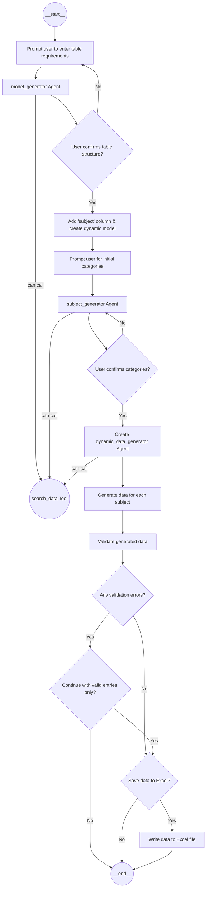

# Tabular Agent

An AI-powered tool for generating table structures and sample data using GPT models.

## Features

- Interactive table structure generation
- Automatic data type inference
- Dynamic Pydantic model creation
- Sample data generation matching the table structure
- Rich console output with formatted tables

## Installation

```bash
pip install -r requirements.txt
```

## Usage

Run the main script:

```bash
python tabular_agent.py
```

The tool will:
1. Ask for your table requirements in plain English
2. Generate a table structure with appropriate columns and data types
3. Show you the proposed structure and ask for feedback
4. Generate sample data matching the structure
5. Display the results in a nicely formatted table

Example prompt:
```
> Enter your requirements for the table data
Create a table for tracking employee performance reviews
```

## Architecture

Tabular Agent utilizes a modular design with several agents that generate, validate, and present table data dynamically.

### Agent Flow



## License

MIT

## Contributing

Contributions are welcome! Please submit issues and pull requests through GitHub.
